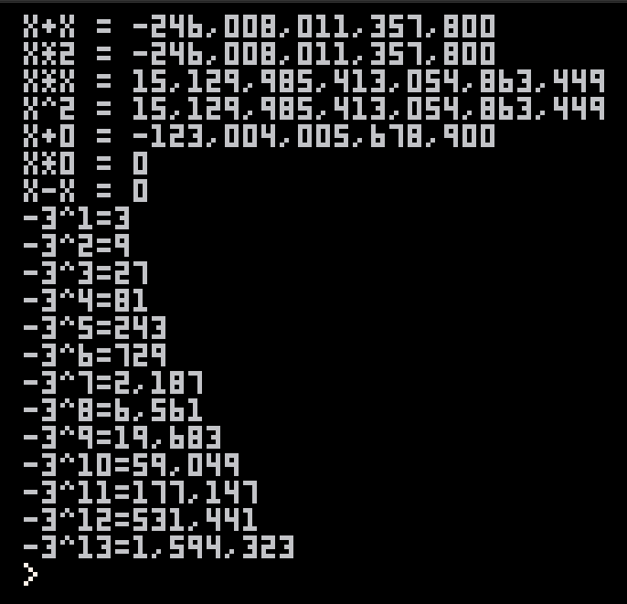

# PICO8 Bigints



## Usage

Construct a bigint with `bigint.new(str)` where `str` is a string consisting
only of digits. The resulting bigint object can be used as a number in most
contexts.

The example above was generated from the following code:

```lua
input_str = "-000123004005678900"
x = bigint.new(input_str)
--for v in all(b.coef) do
-- print(v)
--end
print("x = "..x)
print("x+x = "..x+x)
print("x*2 = "..x*2)
print("x*x = "..x*x)
print("x^2 = "..x^2)
print("x+0 = "..x+0)
print("x*0 = "..x*0)
print("x-x = "..x-x)

b = bigint.new(3)
v = bigint.new(1)
for i=1,13 do
 v = b^i
 print("-3^"..i.."="..b^i)
end
```

## Limitations

I did not implement division. Division makes bigints smaller; this library is
only interested in making them *bigger*.
